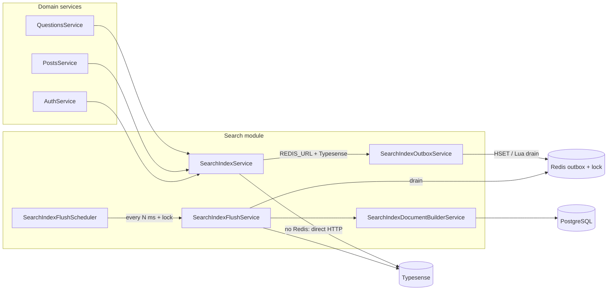
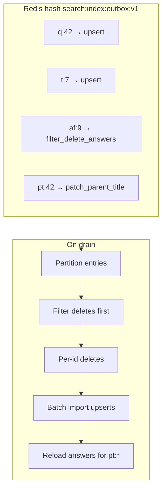
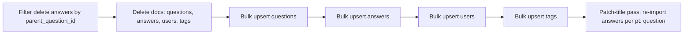
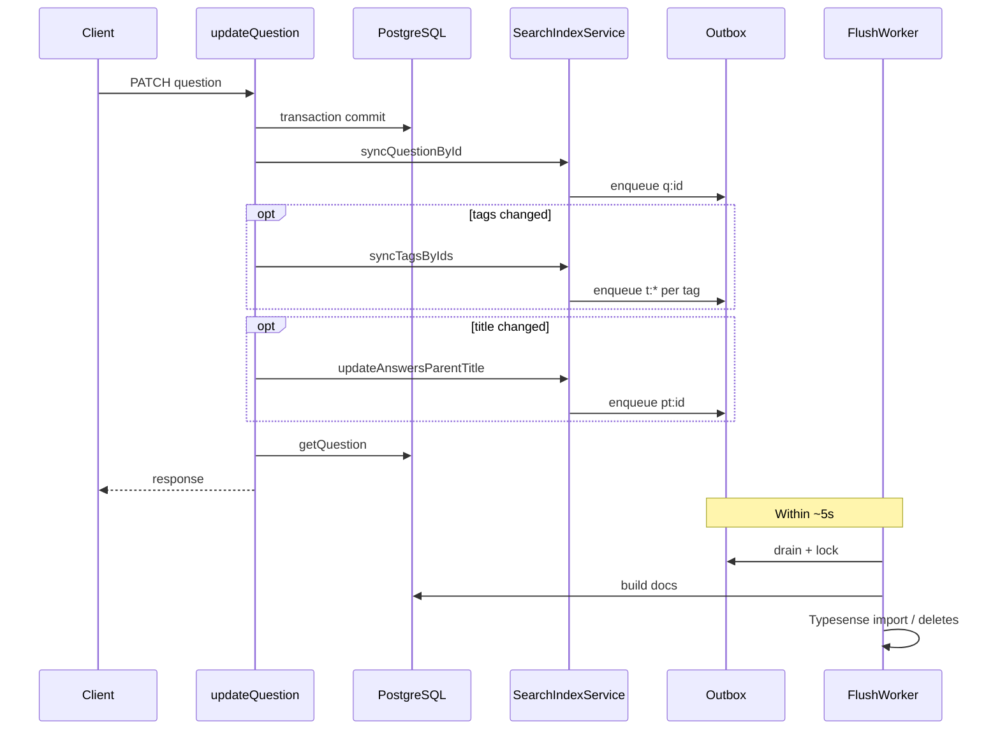

# Typesense index outbox (Redis) and batched flush

This document describes the **batched indexing pipeline**: how write-side updates to Typesense are **coalesced in Redis** and applied on a **fixed interval** (default 5 seconds), instead of issuing one HTTP call per user action.

For global search queries and collection schemas, see [typesense-search.md](./typesense-search.md).

## Goals

- **Absorb bursts**: Many concurrent edits (e.g. thousands of `syncQuestionById` calls) collapse to **one pending entry per logical key** in Redis (last write wins for that key).
- **Batch Typesense writes**: Each tick loads affected rows from **PostgreSQL** and uses **`import` with `action: upsert`** in chunks (200 docs), plus bounded parallel deletes.
- **Multi-instance safe**: A short-lived **distributed lock** ensures only one API replica **drains** the outbox per interval.
- **Graceful fallback**: If `REDIS_URL` is unset, `SearchIndexService` keeps the previous **immediate, fire-and-forget** Typesense behavior.

## Component diagram



## Sequence: enqueue vs flush

When the outbox path is active (`REDIS_URL` set and Typesense client configured):

```mermaid
sequenceDiagram
  participant H as Handler e.g. updateQuestion
  participant SIS as SearchIndexService
  participant O as OutboxService
  participant R as Redis
  participant SCH as FlushScheduler
  participant F as FlushService
  participant P as Prisma
  participant TS as Typesense

  H->>SIS: syncQuestionById(id)
  SIS->>O: enqueueQuestionUpsert(id)
  O->>R: HSET q:id = upsert

  Note over SCH,R: Default interval 5s; NX lock

  SCH->>F: flushTickSafe()
  F->>R: SET lock NX PX ttl
  F->>R: Lua HGETALL + DEL outbox
  R-->>F: drained entries
  F->>P: findMany / build docs
  F->>TS: filter deletes, doc deletes, batch import

  Note over H,TS: HTTP response to user already returned; search lags up to one interval
```

## Redis outbox model

- **Key**: single hash, e.g. `search:index:outbox:v1`.
- **Field**: stable id per target, e.g. `q:123`, `a:456`, `u:7`, `t:9`, `af:100` (filter-delete answers by parent), `pt:100` (reindex answers after question title change).
- **Value**: JSON operation: `upsert`, `delete`, `filter_delete_answers`, `patch_parent_title`.

**Coalescing:** Repeated updates to the same question in one window only keep the **last** `HSET` for `q:123`, so 10,000 redundant enqueues for the same id become **one** flush entry.



## Flush ordering (why it matters)



Deletes and filter-deletes run before upserts so stale index rows are removed first. The `pt:` pass runs after primary answer upserts so embedded `parent_title` stays consistent when titles change.

## Example: user edits a question (outbox path)



## Configuration

| Variable | Role |
|----------|------|
| `REDIS_URL` | Enables outbox + scheduler when set (e.g. `redis://localhost:6390` with Docker port mapping). |
| `SEARCH_INDEX_FLUSH_INTERVAL_MS` | Flush tick interval (default `5000`). Lock TTL is derived and capped so it stays below the interval for multi-pod use. |
| Typesense env vars | Same as main search doc: host, port, protocol, API key. |

Without `REDIS_URL`, `SearchIndexService` uses **`run()`**: async Typesense HTTP per call (previous behavior).

## Reliability tradeoffs

- **At-most-once flush**: If the process crashes after Redis drain but before Typesense finishes, those operations may be lost until a **full reindex** (`reindex:search` script). Postgres remains authoritative; search may be briefly stale.
- **Search lag**: Indexed results can lag real data by up to one flush interval (plus queue wait).

## Related source files

| Area | Path |
|------|------|
| Outbox + Lua drain | `apps/api/src/modules/search/search-outbox.service.ts` |
| Partition drained rows | `apps/api/src/modules/search/search-index-outbox-partition.ts` |
| Flush + batch import | `apps/api/src/modules/search/search-index-flush.service.ts` |
| Interval registration | `apps/api/src/modules/search/search-index-flush.scheduler.ts` |
| Prisma → document shapes | `apps/api/src/modules/search/search-index-document-builder.service.ts` |
| Public API + fallback | `apps/api/src/modules/search/search-index.service.ts` |
| Env helpers | `apps/api/src/modules/search/search-env.ts` |
