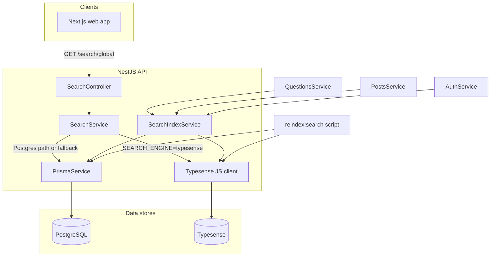

# Typesense search integration

This document describes how **Typesense** is incorporated into Devoverflow for **global search**, the **architecture**, and the **design decisions** behind it.

## Goals

- Add a dedicated search engine that can scale full-text queries and ranking independently of PostgreSQL.
- Keep **PostgreSQL as the source of truth** for all entities; Typesense is a **derived, search-optimized index**.
- Preserve the existing **HTTP contract**: `GET /search/global` and the response shape consumed by the Next.js app (`GlobalSearchResponse`).
- Allow **safe rollout**: switch engines via configuration, with optional **fallback** to the legacy Postgres path if Typesense fails.

## High-level architecture



### Request flow (read path)

1. The web app calls the API (`fetchGlobalSearch` → `GET /search/global?q=...&limitPerType=...`).
2. `SearchService.searchGlobal()` checks `SEARCH_ENGINE`:
   - **`typesense`**: If a Typesense client is configured (`TYPESENSE_HOST` + `TYPESENSE_API_KEY`), it runs **`multi_search`** against four collections in **one** HTTP round-trip, then maps hits to the same JSON shape as before.
   - On Typesense error: if `SEARCH_TYPESENSE_FALLBACK=true`, it logs a warning and runs the **Postgres** implementation; otherwise the error propagates.
   - **`postgres`** (default): The existing implementation runs (trigram / optional FTS flags unchanged).

### Index flow (write path)

1. **`SearchIndexService`** performs **upserts**, **partial updates**, and **deletes** in Typesense when domain data changes.
2. Calls are **fire-and-forget** with **try/catch + logging**: indexing failures must **not** block primary user operations (create question, vote, etc.).
3. A **full rebuild** is supported via **`npm run reindex:search`** in `apps/api`, which recreates collections and bulk-imports from Postgres.

## Code map

| Area | Location | Role |
|------|----------|------|
| Env & engine selection | [`apps/api/src/modules/search/search-env.ts`](../apps/api/src/modules/search/search-env.ts) | `SEARCH_ENGINE`, Typesense node config, fallback flag |
| Collection schemas | [`apps/api/src/modules/search/typesense.collections.ts`](../apps/api/src/modules/search/typesense.collections.ts) | Schema definitions and collection name constants |
| Nest wiring | [`apps/api/src/modules/search/search.module.ts`](../apps/api/src/modules/search/search.module.ts) | `Typesense.Client` factory, `TYPESENSE_CLIENT` token, exports |
| Search execution | [`apps/api/src/modules/search/search.service.ts`](../apps/api/src/modules/search/search.service.ts) | `searchGlobal`, `searchGlobalTypesense`, `searchGlobalPostgres` |
| Index mutations | [`apps/api/src/modules/search/search-index.service.ts`](../apps/api/src/modules/search/search-index.service.ts) | Upsert/delete/patch documents after writes |
| Reindex CLI | [`apps/api/scripts/reindex-search.ts`](../apps/api/scripts/reindex-search.ts) | Drop/create collections, bulk import from Prisma |
| HTTP surface | [`apps/api/src/modules/search/search.controller.ts`](../apps/api/src/modules/search/search.controller.ts) | Unchanged route `GET /search/global` |

## Collections design

We use **four collections**, mirroring the four parallel buckets the Postgres implementation fetches (questions, answers, users, tags):

| Collection | Purpose |
|------------|---------|
| `search_questions` | Questions: title, body, tags, author, votes, recency |
| `search_answers` | Answers: body, parent question title, author, votes |
| `search_users` | Users: username, full name, reputation (ACTIVE only in queries) |
| `search_tags` | Tags: slug, display name, question count |

**Document IDs** are stringified numeric primary keys from Postgres (`"42"`), consistent with Typesense’s string `id` field.

**Filters** applied at query time:

- Posts: `status:=ACTIVE` (questions and answers).
- Users: `status:=ACTIVE` (aligned with the Postgres user search).

**Ranking (sort)** is intentionally an approximation of the older Postgres composite score:

- Questions/answers: `_text_match`, then `up_vote_count`, then `created_at`.
- Users: `_text_match`, then `reputation`.
- Tags: `_text_match`, then `question_count`, then `display_name`.

Exact parity with `ts_rank_cd` + vote/recency SQL is **not** required for the first iteration; tuning can follow production feedback.

**`multi_search`**: A single Typesense API call issues four searches with the same `q` and per-type `per_page` (`limitPerType`). That matches the previous `Promise.all` of four DB queries while reducing latency and connection overhead.

## Denormalized documents (hydration strategy)

We chose **Option A** from the original plan: store **enough fields in each Typesense document** to build `GlobalSearchResponse` **without** a second Prisma `findMany` after search.

**Rationale:**

- Lower latency and simpler failure modes (search result = display result).
- Matches what we already select in SQL for the Postgres path.

Trade-off: more fields to keep in sync when data changes; that is handled by `SearchIndexService` and the reindex script.

## Incremental indexing (where hooks run)

| Event | Index action |
|-------|----------------|
| Create/update question | Upsert question document; on title change, patch `parent_title` on all answer documents for that question |
| Delete question | Remove question document; delete answers by filter `parent_question_id`; resync affected tags |
| Create answer | Upsert answer document |
| Vote on post | Patch `up_vote_count` on the question or answer document (or remove if status no longer ACTIVE) |
| Create user (sign-up / OAuth) | Upsert user document |
| Tag counts change (question tags) | Upsert affected tag documents |

Modules that import `SearchModule` for `SearchIndexService`: **Auth**, **Questions**, **Posts**.

## Configuration

Documented in [`.env.example`](../.env.example):

| Variable | Meaning |
|----------|---------|
| `SEARCH_ENGINE` | `postgres` (default) or `typesense` |
| `SEARCH_TYPESENSE_FALLBACK` | `true` to fall back to Postgres when Typesense errors |
| `TYPESENSE_HOST` | Hostname only (no scheme/path) |
| `TYPESENSE_PORT` | e.g. `8110` (local Docker mapped port) or `443` (cloud) |
| `TYPESENSE_PROTOCOL` | `http` or `https` |
| `TYPESENSE_API_KEY` | Server-side key with rights to search and manage indexed collections (typically **admin** for our server; never expose to the browser) |

If `TYPESENSE_HOST` or `TYPESENSE_API_KEY` is missing, the Nest factory provides **`null`** for `TYPESENSE_CLIENT`; with `SEARCH_ENGINE=typesense`, the service **falls through** to the Postgres path (no client), so configure env carefully before enabling Typesense in production.

**Local Docker**: [`docker-compose.yml`](../docker-compose.yml) includes a `typesense` service (image `typesense/typesense:0.29.0`, API on host port **8110** by default).

## Security

- The Typesense **API key lives only on the API** process environment—same trust boundary as `DATABASE_URL`.
- The Next.js app **does not** talk to Typesense directly; it only calls the Nest API.
- **Search-only keys** from Typesense are appropriate if a future design ever calls Typesense from the browser; the current design does not need that.
- Credential export files should stay **gitignored** (see `.gitignore` pattern for `*-api-keys-*.txt`).

## Operations

### Initial / full reindex

From repo root (or `apps/api`):

```bash
npm run reindex:search --workspace=api
```

Loads `.env` from monorepo root (see script). **Recreates** collections—use with care in shared environments; plan for downtime or a blue/green alias strategy later if needed.

### Verify Typesense health

```bash
curl -s -H "X-TYPESENSE-API-KEY: <key>" "https://<host>/health"
```

Use `http://localhost:8110` for local compose with the key from `docker-compose.yml`.

### Verify app search

With `SEARCH_ENGINE=typesense` and the API restarted, open the web app and use **global search** (header). In DevTools **Network**, confirm `GET .../search/global` returns **200** and populated sections.

## Design decisions (summary)

1.  **PostgreSQL remains SoT** — Typesense is a projection; all authoritative writes go to Prisma/Postgres first.
2.  **Feature flag (`SEARCH_ENGINE`)** — Enables staging and production cutover without a second deploy artifact.
3.  **Optional fallback** — `SEARCH_TYPESENSE_FALLBACK` reduces blast radius during incidents.
4.  **Four collections + `multi_search`** — Preserves the product’s four-tab global search with one Typesense HTTP call.
5.  **Denormalized docs** — Prefer speed and simplicity over minimal document shape + post-fetch joins.
6.  **Non-blocking index updates** — Product actions succeed even if Typesense is temporarily unavailable (at the cost of stale search until retry or reindex).
7.  **Separate reindex script** — Full rebuild is explicit and runnable in CI or by operators; not hidden inside app boot.
8.  **Keep Postgres search path** — Until Typesense is proven in production, the legacy path remains fully implemented for rollback and fallback.

## Relation to existing Postgres search

The Postgres implementation (`searchGlobalPostgres`) retains:

- Trigram + optional FTS (`SEARCH_FTS_POSTS`, etc.)
- Tag prefetch and body guardrail behavior

The Typesense path **does not** reuse those branches; Typesense handles tokenization, typos, and ranking natively. Short-query behavior may differ slightly from `short_partial` special-casing in SQL—that is an accepted trade-off unless we later align behavior with query parameters.

## References

- [Typesense documentation](https://typesense.org/docs/)
- [Multi-search API](https://typesense.org/docs/latest/api/federated-multi-search.html)
- [Server configuration / environment variables](https://typesense.org/docs/latest/api/server-configuration.html#using-environment-variables)
